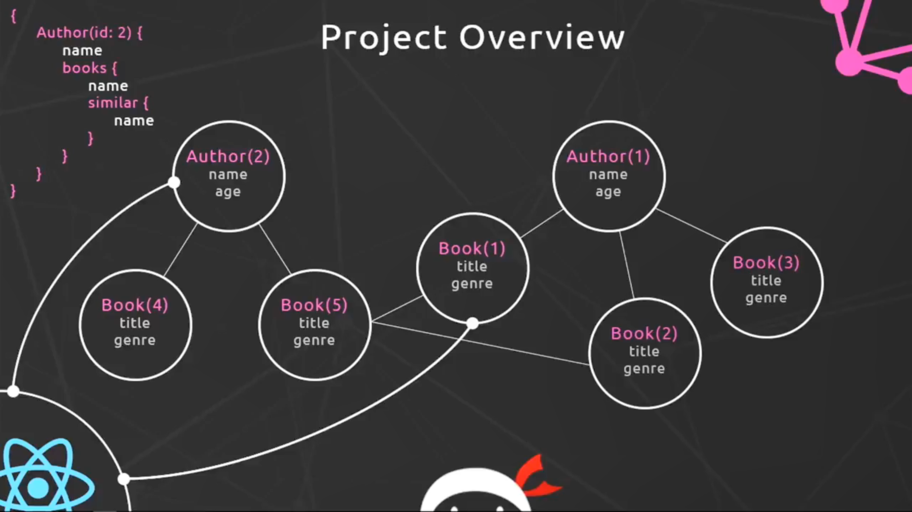
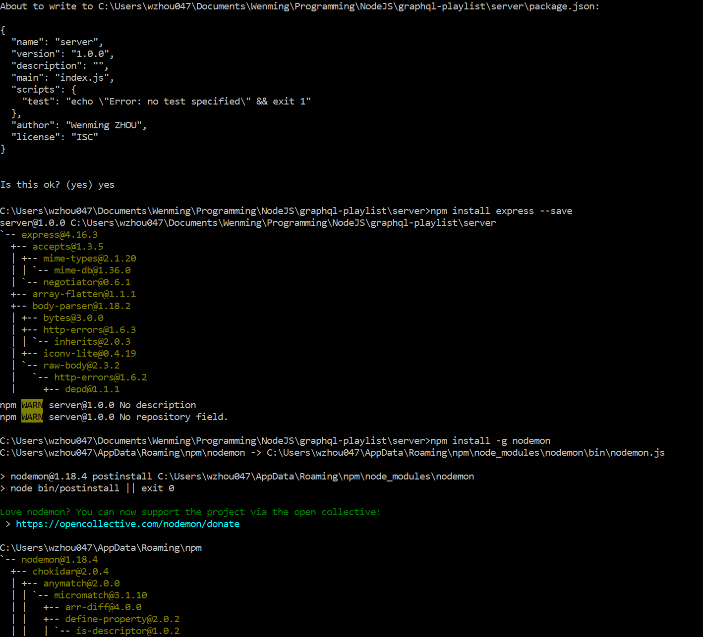
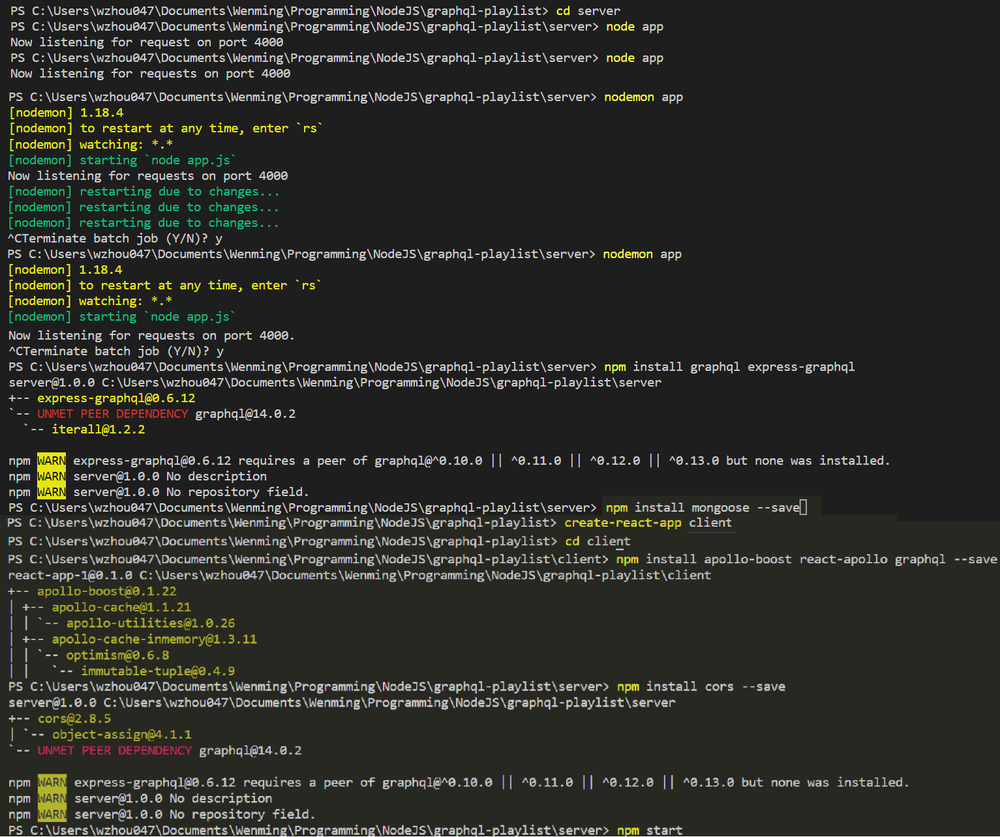
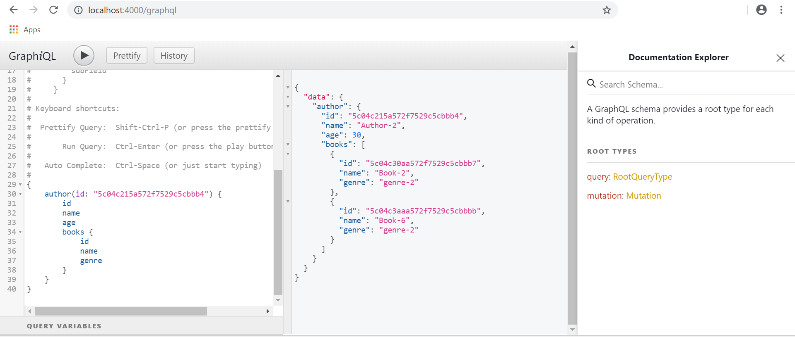
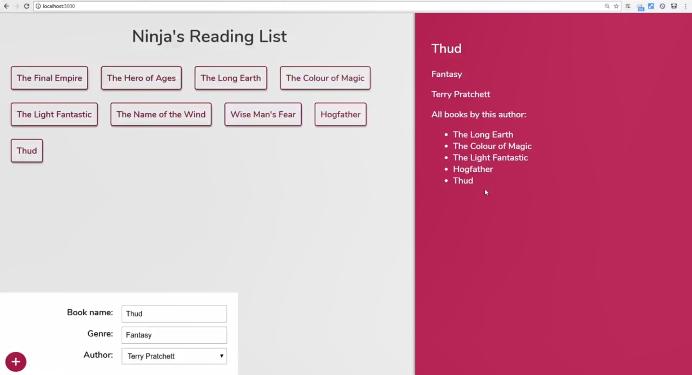

# GraphQL_Playlist Application Guide

_From:_ [GraphQL Full Course - Novice to Expert](https://www.youtube.com/watch?v=ed8SzALpx1Q)

## 1. Run

**Start Server:**

> `cd /server`

> `npm install`

> `npm start`

**Start Client:**

> `cd /client`

> `npm install`

> `npm start`

## 2. Architecture

**Server:**
*Express + GraphQL Server + MongoDB*

**Client:**
*React + Apollo(GraphQL Client)*

 

 

 

 

 

 

 

 

 

 

 
